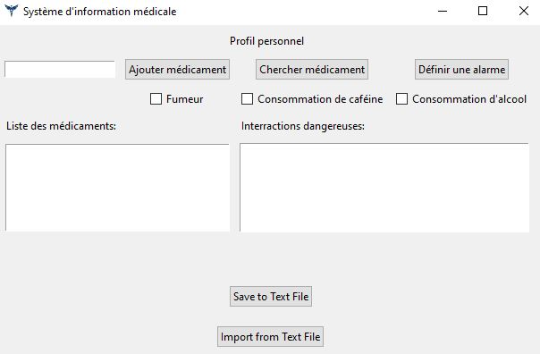
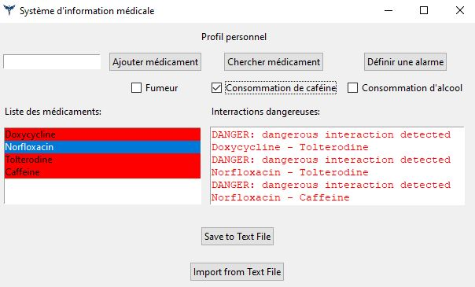
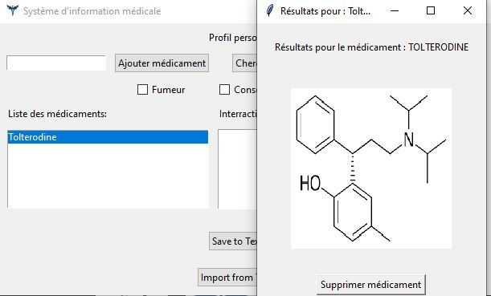
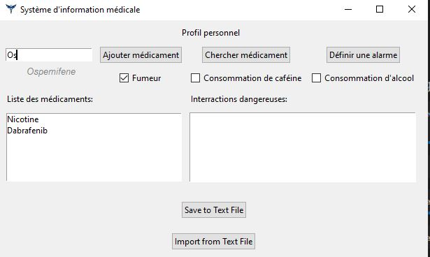

# Drug-Drug Interaction Checker

A tool to detect and analyze potential interactions between drugs. Useful for clinicians, pharmacists, researchers, or anyone interested in drug safety.

---

## Features

- Input drugs and get a report on possible interactions  
- Summaries of the interaction severity  
- Optional details: mechanisms, evidence, side effects
- Simple UI, molecule viewer
- Add alarms for recurrent drug intake

## Screenshots

Here are some example screenshots of the tool in action:

  
*Main interface showing drug input form*

  
*Interaction results summary*

  
*Drug information*

  
*Lookup over 1000+ interractions and drugs*

